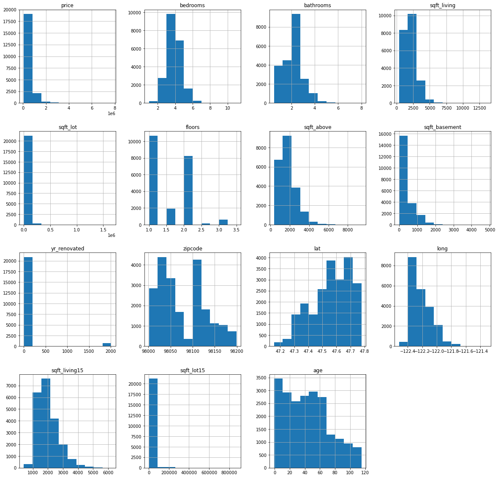
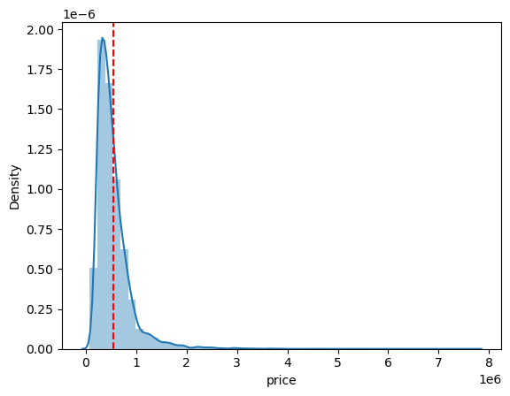
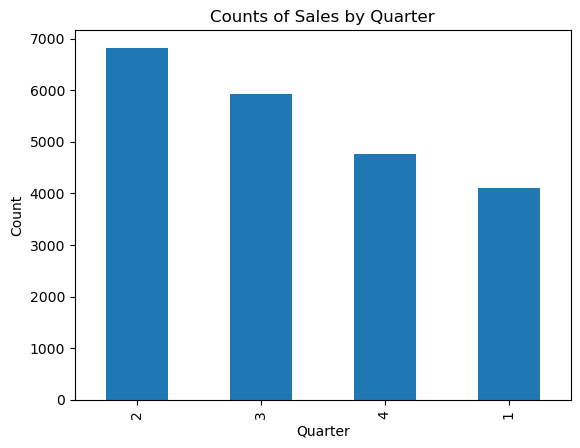

# King County Houses Multiple Regression Analysis

Student names:
    - Billy Mwangi
    - Lynne Mutwiri
    - Sharon Kimani
    - Susan Kanyora
    - Kellen Kinya 
    - Derrick Wekesa

## Business Overview:
According to the 2020 census, King County was the most populous county in Washington, and the 13th-most populous in the United States. It is in Seattle, the state's most populous city. Given the statistics, Tella Real Estate Agency, based in King County, has undertaken a research to find out the best performing metrics when it comes to house sale prices determination. As such, we went all out to do multiple regression analysis to gain insights into the home sales market and improve the sellers' chances to make sales. By identifying the key factors that affect the sale prices of houses, the agency can develop more effective marketing strategies, help sellers target the right buyers, and make better investment decisions.

## Problem Statement
Tello Real Estate Agency has a dataset of home features collected from the county houses. They include the number of bathrooms, number of bedrooms, number of floors, square footage of living space amongst others, as seen in the dataset attached. The agency wants to understand the relationship between these features and the sale prices of houses in King County, and particularly, which features most affect the prices. 

## Objectives
The following are the questions whose answers we have come up with in this analysis:
* To understand the relationships between the various features and the sale price of a house.
* To determine the peak house sale season.
* To build a multiple linear regression model that identifies the most important factors that influence the sale price of a house.
* To use the model to gain insights into the home sales market and improve decision-making processes.

## Data Understanding and Analysis

### Source of Data
We used the following data to compute our analysis:
* King County House Sales found https://github.com/learn-co-curriculum/dsc-phase-2-project-v2-3/blob/main/data/kc_house_data.csv 

### Data Analysis
* Our data had 21 features that we worked with to come up with the best predictive model.
* We started by analyzing each of the house features individually by looking at their charecteristics and distribution.
* As part of preparing our data for analysis, we cleaned it as outlined stepwise in our notebook.
* Next, we tracked the relationship amongst the individual variables with each other.
* For our data with categorical variables as well as that which wasn't normally distributed, we did some feature engineering for variables we felt would hav an impact in the analysis.
* Finally, we modelled various variables to see how the regression compared to our baseline model in determining the house prices.

### Data Visualization

### Graph of individual variables' distribution:

### A look at the price dstribution:

### How the various seasons impact house purchase:

## Challenges
* The model does have some limitations: given that some of the variables needed to be log-transformed to satisfy regression assumptions, any new data used with the model would have to undergo similar preprocessing. 
* Additionally, given regional differences in housing prices, the model's applicability to data from other counties may be limited. 
* Due to the presence of high multicollinearity among several predictor variables, we had to remove some of those columns from our analysis.

## Conclusion
* The variables that have a major influence on the price of the house are; square foot living, age of the house,good condition of the house,if the house is on a waterfront and has an excellent view.
* The variables that has the least influence on the price of the house are; grade, number of bedrooms, sqft lot, sqft basement and sqft lot 15.
* For those looking for economical housing options, it might be wise to consider sacrificing spacious living quarters or a scenic waterfront view.

We can also see that:

- The highest number of house sales are made in the second quarter of the year (Q2: April 1 - June 30) which fall in the Spring season
- The lowest number of house sales are made in the first quarter of the year (Q1: January 1 - March 31) which fall mostly in the Winter season

## Recommendations
* Revonate their house since this increases the value of the house
* Ensure that the houses are in good condition before putting it into the market for sale
* Increase square footage of living space 
* Put up their houses for sale in peak season-Spring

## Future work
* Reducing noise in the data to improve the accuracy of our model. 
* Additionally investigate certain features, such as constructional/architectural values of the house, to see what trends we could discern from that. 
